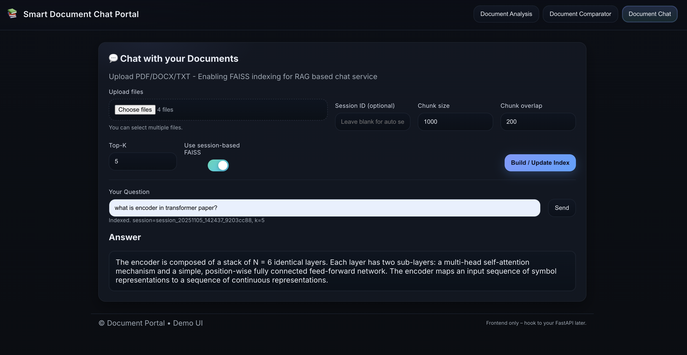
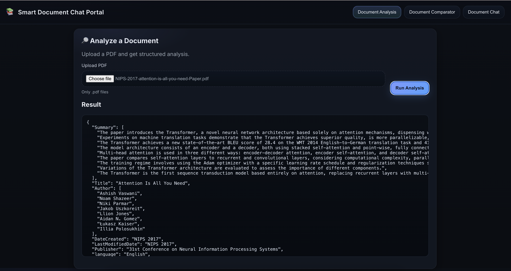
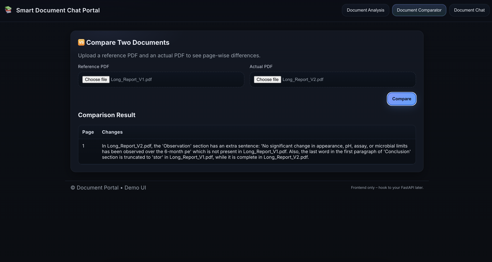

# Smart Document Chat Portal

Scalable and interactive portal for document analysis and intelligent chat using advanced RAG pipeline.Unified data ingestion and indexing with FAISS.
Conversation interface for single and multiple documents.

---

## 🚀 Application supports following 3 services:

- **Multi Document Chat (RAG)**: Upload and process PDF, DOCX, TXT files, create a FAISS index, chat with all the documents
- **Document Analyzer**: Analyze/Summarize the uploaded PDF document
- **Document Comparator**: Compare actual and reference pdf documents for the observed differences.
---

## UI snapshot: RAG Apllication for Multi Document Chat


---

## UI snapshots: Document Analyzer


---

## UI snapshots: Document Comparator


---

## 🏗️ Architecture Overview

The Smart Document Chat Portal follows a scalable RAG (Retrieval-Augmented Generation) architecture:

1. **Document Ingestion Layer**: Handles file uploads, parsing, and text extraction
2. **Embedding Generation**: Converts document chunks into vector embeddings
3. **Vector Storage**: Stores embeddings in a vector database (FAISS)
4. **Retrieval Engine**: Semantic search to find relevant document passages
5. **LLM Integration**: Generates contextual responses using retrieved information
6. **Web Interface**: User-friendly chat interface for document interaction

---

## 📁 Project Structure

```
smart-document-chat-portal/
├── api/
│   ├── main.py.                    # Main application entry point
│                   
├── config/
│   ├── config.yaml                  # configuration management
│ 
├── exception/
│   ├── custom_exception.py         # exception management
│ 
├── logger/
│   ├── custome_logger.py           # logger management
│ 
├── model/
│   ├── models.py                # pydantic validation
│ 
├── notebooks/                      # Jupyter notebooks for experimentation
│   ├── exception_experiment.ipynb  # exception handling
│   ├── experiments.ipynb           # LLm,Vector embedding experiments
│   ├── logging_experiments.ipynb    # logger handling
│  
├── prompt/
│   ├── prompt_library.py          # prompt management library with prompt registry
│ 
├── src/                           # Source code directory
│   ├── document_analyzer/        # Data analysis service     
│   │   ├── data_analysis.py    
│   │
│   ├── document_chat/            # RAG multi chat service
│   │   ├── retrieval.py
│   │
│   ├── document_comparison/      # Document comparison service
│   │   ├──document_comparator.py
│   │
│   ├── document_ingestion/       # unified data ingestion service        
│   │   └── data_ingestion.py     
│
├── static/                       # Frontend UI stylesheet
│   ├── style.css                  
│
├── templates/                    # HTML template
│   ├── index.html                
│
├── utils/                        # utility functions
│   ├── config_loader.py          # loading configurations
│   ├── document_ops.py           # document operations
│   ├── model_loader.py           # loading llm and embedding models
│   └── file_io.py                # file input/output operations
│
├── pyproject.toml                 # UV dependencies
├── requirements.txt               # Python dependencies
├── setup.py                       # setup for creating package
├── test.py                        # testing pipelines
├── .gitignore                     # Git ignore rules
├── Dockerfile                     # Docker container definition
└── README.md                      # Project details
```

---

## 🛠️ Technology Stack

### Core Technologies
- **Python 3.10+**: Primary programming language
- **LangChain**: LLM application framework
- **Groq/Google**: LLM providers for text generation

### Document Processing
- **PyPDF2/pdfplumber**: PDF parsing
- **python-docx**: Word document processing

### Vector Storage & Search
- **FAISS**: Fast similarity search

### Web Framework
- **FastAPI**: Backend API framework
- **HTML/CSS**: Frontend interface


---
### API Keys Required

You'll need API keys for the following services:

- **Groq API Key** 
- **Google API Key** 


---

## ⚙️ Installation & Setup

### 1. Clone the Repository

```bash
git clone https://github.com/vikaspandey92/smart-document-chat-portal.git
cd smart-document-chat-portal
```

### 2. Create Virtual Environment

```bash
# Create virtual environment
python -m venv venv

# Activate virtual environment
# On Linux/Mac:
source venv/bin/activate

# On Windows:
venv\Scripts\activate
```

### 3. Install Dependencies

```bash
# Install Python packages
pip install --upgrade pip
pip install -r requirements.txt

```


